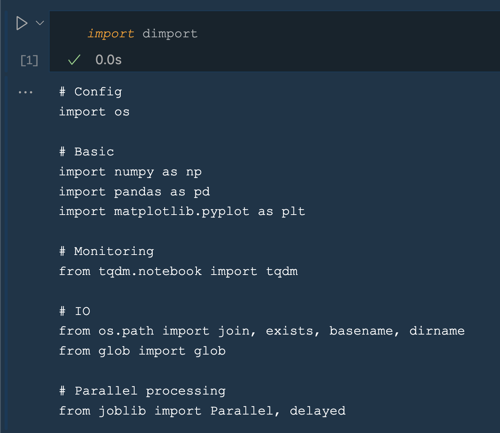
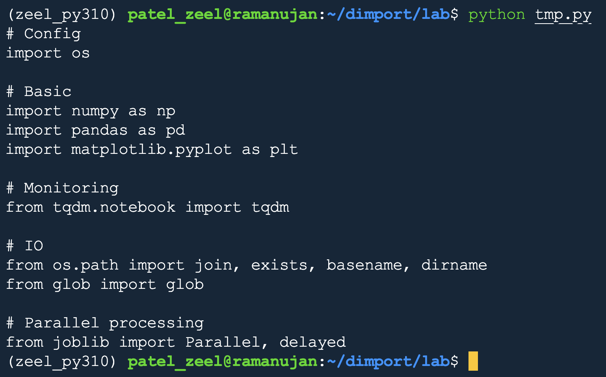

`dimport`: Your **D**efault **Import**s

# Install
```bash
pip install dimport
```

# Quick Start

## For jupyter notebooks
Import `dimport` when you create a new notebook.
```python
import dimport
```

On the first time cell execution, it will print the default imports.


Copy-paste the printed lines in your notebook and remove (or keep if you want!) the `import dimport` line. That's it!

## For python scripts
Import `dimport` at the beginning of your script.
```python
import dimport
```

Run the script from the terminal. It will print the default imports.


Copy-paste the printed lines in your script and remove `import dimport` line. That's it!

<font color='red'>**Note:**</font> You can modify the default imports as per your needs!

## Modify the default imports

When you `import dimport` for the first time after installation, it creates `~/.dimport` directory and saves the default imports in the `~/.dimport/.default` file. You can simply modify `~/.dimport/.default` file to change your default imports as per your needs!